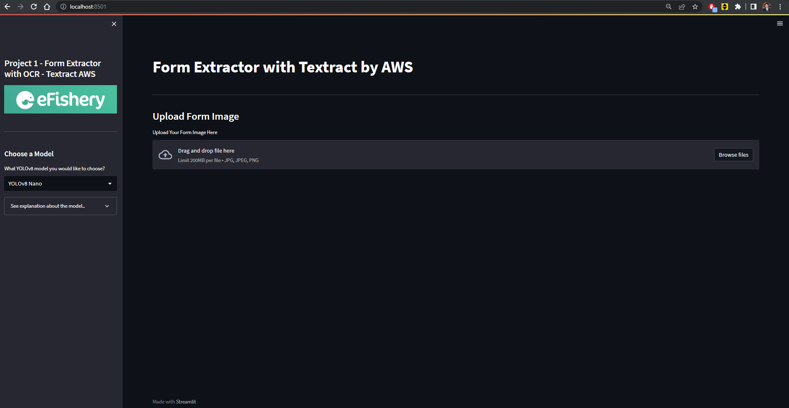
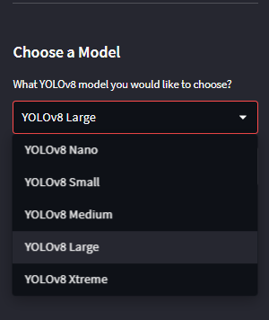
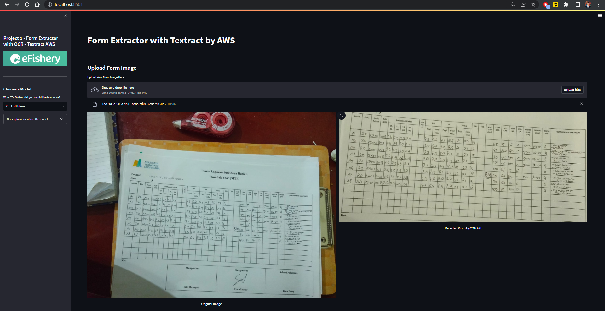
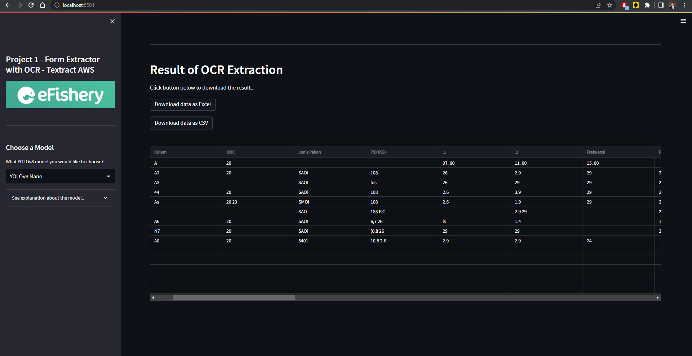

<div align="center" style="text-align: center">

<p style="text-align: center">
  
</p>

</div>

# eFishery Task 1 - Form Extraction OCR
<p> Hi.. </p>
The purpose of this project is to be able detect, extract, and display a form from an image.
This is also part of take home test for applying Machine Learning Computer Vision Engineer in eFishery.

## Problem
We received daily task writing reseach form of fish cultivation, the writing is still on the paper. Our aim is to digitalize those daily fish cultivation form data, but it will be painfull to manually insert the data through every single papers.
<br>
We need a progam that able to detect, extract, and save the form data from an image.
  
## Idea & Solution
To fulfill those aim, we create a web based platform to be able detect, extract, and save the data from an image.
Deep learning approach were made to solved this problem, by using YOLOv8 (You Only Look Once version 8) we be able to segmentated the table area.

  How it work
  1. Prepare the dataset, annotate the image, and export it into YOLOv8 format (I used Roboflow to do this).
  2. Train the pretrained models of YOLOv8 with our dataset.
  3. Use ClearML to tracks and controls the process, performance metrics, and model storing.
  4. Create the platform using streamlit and inference the image using the our trained model.
  5. We used AWS Textract to do the Optical Character Recognition.
  
## Installation and Usage
Here is the instruction about how to install and run the program.
<br>
### PYTHON USAGE
1. Clone this git repo, you can download or use commmand below
```
git clone https://github.com/aditya39/eFishery-Task1-FormExtractionOCR.git
```
2. Install depedency (Recommend to create Virtual Environtment first before doing this step)
   Enter the project directory then run this command in CLI like CMD:
```
pip install -r requirements.txt
```
4. To run the program, run this command below on CLI
```
streamlit run app.py
```
5. Browser will automatically open, if not, type localhost:8501 to broweser address. Web application page will be open.

### DOCKER COMPOSE
1. Clone this git repository by run command below.
```
git clone https://github.com/aditya39/eFishery-Task1-FormExtractionOCR.git
```
2. To run the app, open CLI on the directory of the program and run this command.
```
docker-compose up
```
3. Wait to load and install depedency, after done you can go to browser and run localhost:8501, app should be running.
4. To stop the docker, run this command.
```
docker-compose down
```

## Application Display
### Input gambar
<p style="text-align: center">
  
</p>

### Choose model
<p style="text-align: center">
  
</p>

### Result
<p style="text-align: center">
  
</p>
<p style="text-align: center">
  
</p>
